# GodoTutorial
This is a tutorial repo for some friends on some Godot basics. Not much to see here.


# Getting Set Up
There's a few tools you'll need to have downloaded and ready before we get started.
## Downloading the Engine/Dependencies
First thing's first, you need to download the game engine. <br>Go to [this page](https://godotengine.org/download/windows/) and **download the .NET version of Godot**, circled in red below.<br><br>
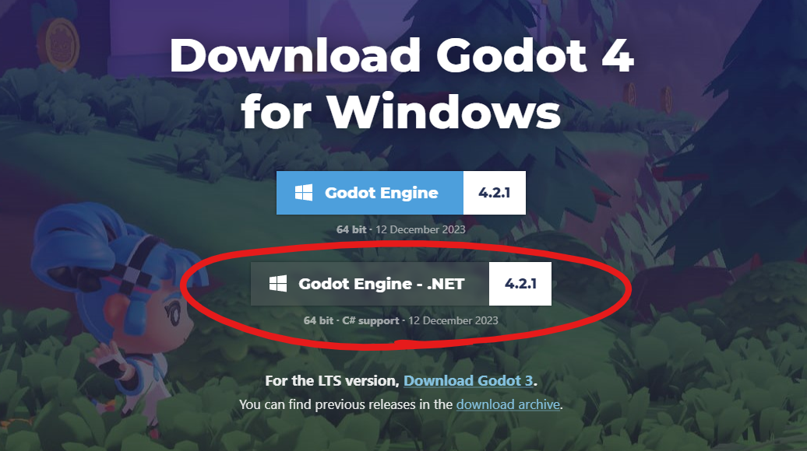

The game engine comes in a zip folder, so extract it to somewhere more permanent (or don't, I'm not your mom).

---

Next you will want to go to the [.NET download page](https://dotnet.microsoft.com/en-us/download) and get .NET 8.0 by clicking the .NET SDK x64 button, then following the installation instructions. (I didn't end up needing the command line stuff)<br><br>
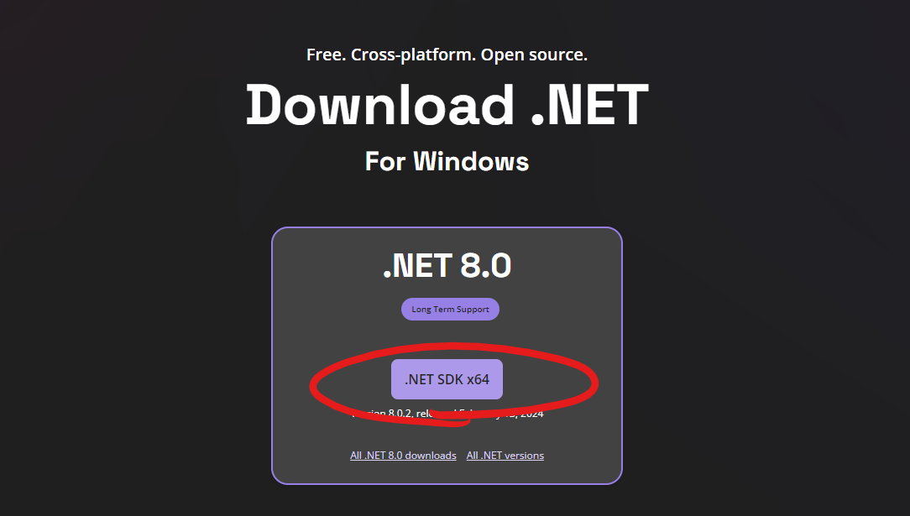

## GitHub
GitHub Desktop is a great way to manage versions of projects. This will allow us to work independently and keep projects consistent between one another. [Download GitHub Desktop](https://desktop.github.com/) and follow the installation instructions.<br><br>
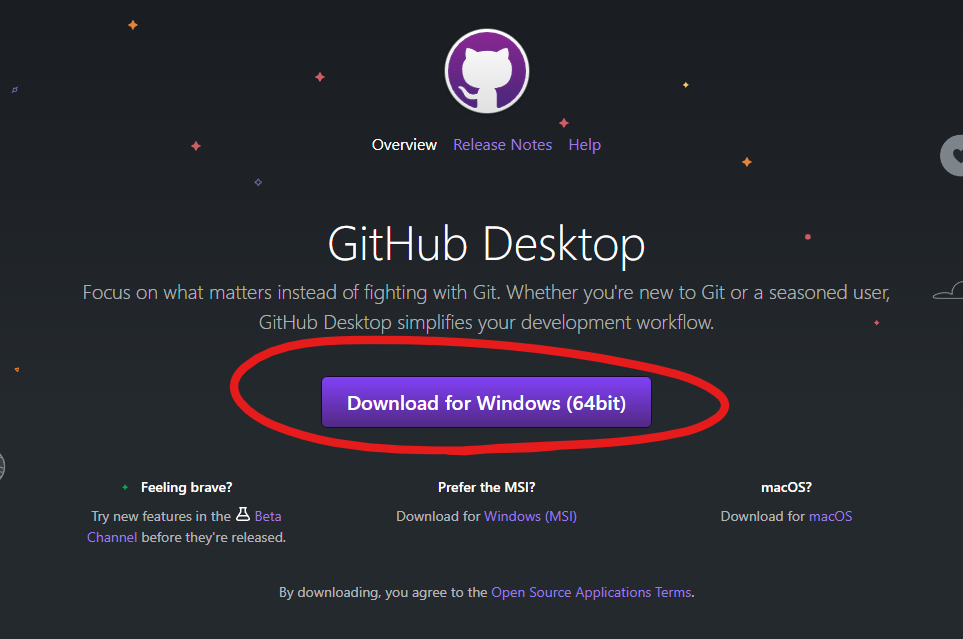
You can also use command-line git if that makes you happier.

## (Optional) Visual Studio Code
Godot has a built-in editor that works fine, but if you're like me and you want to use something a little more portable, then there is VSCode support. You can download VSCode and follow the installation instructions.<br><br>
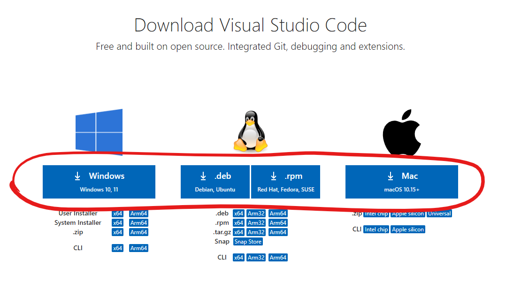

Here is a [good video](https://youtu.be/egtBFbWz7N4?si=qkvJw5ZxDrjRuPw9) on how to get VSCode set up, as well as general installation instructions. I noticed the only discrepancy here was in the editor settings, where I had to paste in the path to my VSCode.


# Getting Started
So you think you set everything up right? Well, we'll see about that.<br>
Since everyone has a different skillset, I'll be going in-depth on how to do everything. If something seems familiar, feel free to skip ahead. I'll try to **put any surprising information in bold** so that you can look for it if the rest of the information is just review for you.

## Downloading the Repo
If you didn't know, the project is stored in a git repository, which is essentially where everything you need to build the project will be stored.

1. Open GitHub Desktop and sign in with your GitHub information (if you don't have an account, [go to the website](https://github.com) and sign up).
2. Hit File -> Clone Repository, and select the URL tab.
3. Copy the address of [this GitHub repo](https://github.com/Shropp/GodoTutorial) and paste it into the URL tab. You can find it by hitting the ```<> Code``` button, going to the local tab, and selecting HTTPS.<br><br>
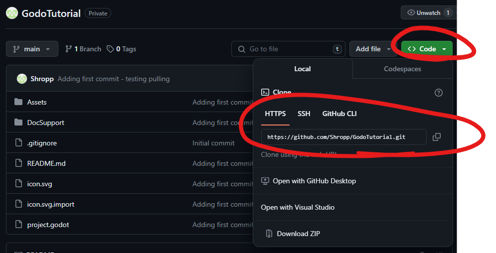<br><br>
4. Hit Clone, and the project should download.<br><br>
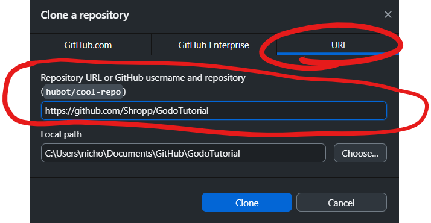

## Importing the Project
This is a very straightforward part of the process - you just need the path where the repo is.
1. Launch Godot by running the executable in your extracted folder.
2. When you launch, hit the import button and navigate to the directory containing the project. Once you've selected it, hit ```Import and Edit``` to open the project.<br><br>
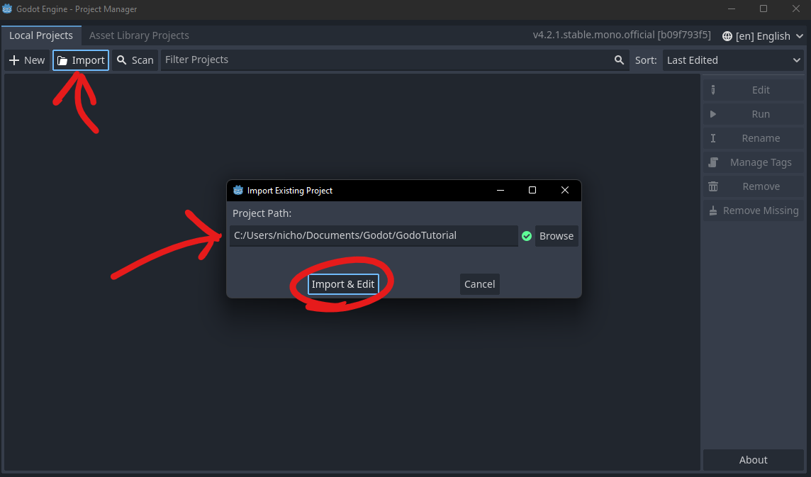

## Testing the installation
Once it's started, you should be able to hit the play button at the top right to build and run the project. If this is done properly, you should have a gray window appear in the center of your screen and a message in the console telling you everything worked as intended.<br><br>
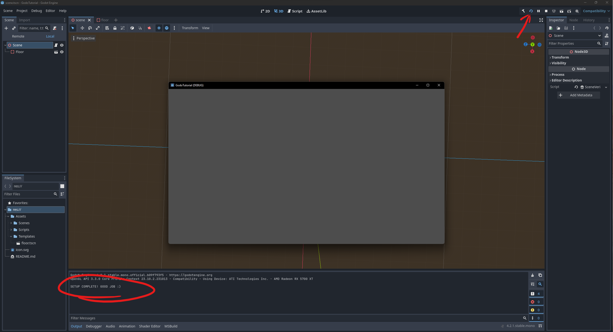

# Godot Basics
My understanding of the engine comes from my brief work with Unity, which seems to translate pretty well.
## Layout

Here's a labeled image of the screen. All of these are also labeled in the editor.<br><br>
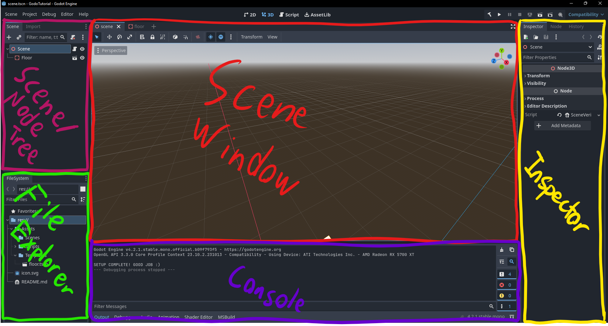

Some of these are evident, but here's a one-line summary of what each of these does. We'll get more involved in a minute.
* **Scene/Node Tree**: Keep track of loaded nodes (players, items, objects, etc.) in your scene.
* **File Explorer**: Browse files in your project, keep track of/use saved work.
* **Scene Window**: Interactive preview look at your scene, capable of making adjustments.
* **Console**: Read debug messages from your code (this will be very useful).
* **Inspector**: Modify elements of the selected node.

## Nodes
A **Node** is a base element in Godot. Almost everything is a node - the player, the camera, the background, even the whole scene.

With the project open, go ahead and click on the *Floor* Node in the Scene Tree, and take a look at the Inspector. There should be many properties that appear as part of this game object, most of which you do not have to understand at the moment. 

What you *should* pick up from this is that there are several categories here:
* StaticBody3D
* PhysicsBody3D
* CollisionObject3D
* Node3D
* Node

This is actually an **order of inheritance** for the ```StaticBody3D``` type. For those of you familiar with object-oriented programming and sub/super classes, this should be a refresher, so skip to where I bolded Go ahead. if this is new for anyone, here's an analogy:

Let's say you wanted to classify an object, of any sort. Let's say, Pepperoni Pizza. 
* ```Pepperoni Pizza``` can have different types of pepperoni on it, like old world or vegan.
* Pepperoni Pizza is a type of ```Pizza```. Pizza has a dough, sauce, and cheese. 
* Likewise, Pizza falls under ```Italian Cuisine```, which is likely to have cheese and tomato sauce.
* Italian Cuisine falls squarely under ```Food```, which can be consumed. 
* And food falls under the top, umbrella class of ```Object```, which exists. 

Each of these sub-classifications of 'Object' specifies something to be added on. Think 'a square is a rectangle, but a rectangle is not necessarily a square,' or in this case, 'a pepperoni pizza is an object, but an object is not necessarily a pepperoni pizza.'

In the case of the game engine, this works the same way. 
* ```StaticBody3D``` can have a physics material, constant linear velocity, and constant angular velocity.
* StaticBody3D is a subclassification of ```PhysicsBody3D```, which allows the object to lock certain attributes of its motion and allows it to interact with the physics system. 
* PhysicsBody3D is a subclass of ```CollisionObject3D```, which defines which other objects will allow 'collision' (meaning they won't pass through each other)
* CollisionBody3D is a subclass of ```Node3D```, which defines where and how the object looks in 3D space.
* Finally, Node3D is a subclass of ```Node```, the base class of everything in the game engine.

---
**Go ahead** and click the dropdown for ```transform``` under ```Node3D```.<br><br>
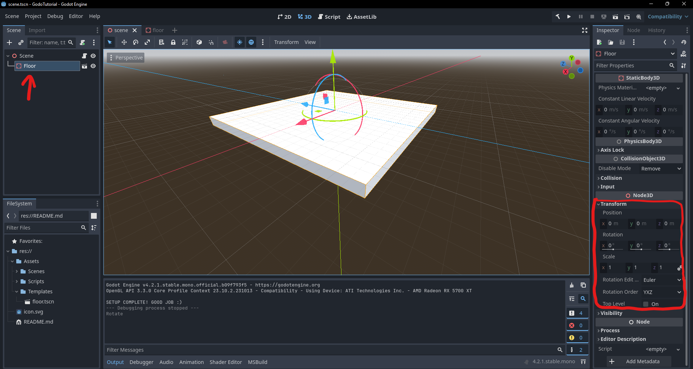

Here you can play around with adjusting the floor. Edit the settings here to see what they do.

Floor is actually composed of other objects, but it is saved as a **template**. Templates are blueprints used to instantiate more of the same object. The actual information for the contents of Floor are in ```Assets/Templates/floor.tscn```. Go ahead and find *floor.tscn* in your file browser and drag it onto ```Scene``` in the Scene Tree to create Floor2. Once you've done that, click Floor2 and adjust the x position to be 20 in the transform.<br><br>
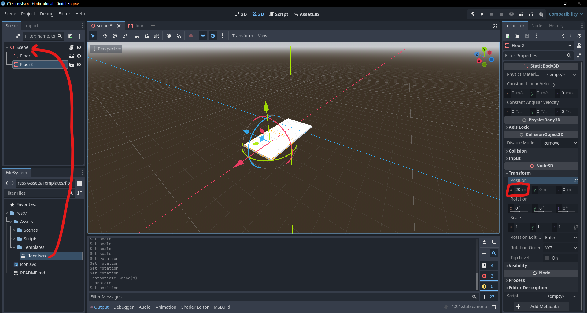

You can open up the template and make modifications by opening *Assets/Templates/floor.tscn* or hitting the *Open in Editor* button next to Floor. Another tab should appear at the top of your scene window. Do that now.<br><br>
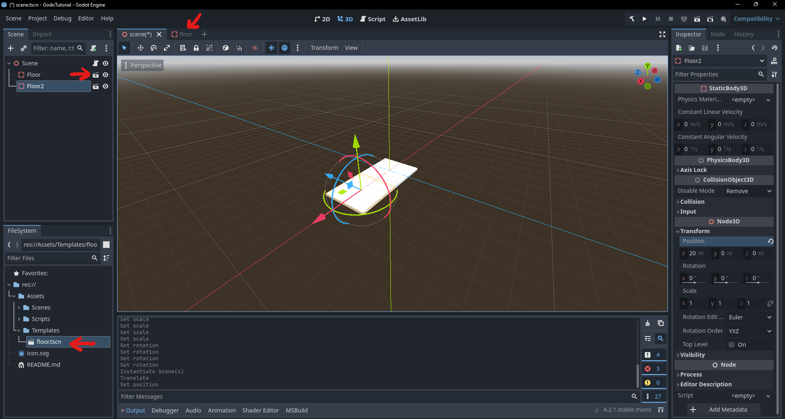

If you look at the Scene tree on the right, you'll see that Floor seems to have its own hierarchy:<br><br>
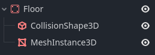<br>
These are objects contained within Floor. Here's the rundown:
* Floor itself, as discussed before, is a ```StaticBody3D```
* Inside Floor is a ```CollisionShape3D```, which defines the collision box for the floor (this can be seen by pressing the "eye" icon next to MeshInstance3D to disable its visibility)
* Also inside Floor is a ```MeshInstance3D```, which draws the box you visibly see as the floor.

You can get a better look at what these do by inspecting them (note for CollisionShape3D and MeshInstance3D you will need to click on Shape/Mesh respectively to find the box bounds). Feel free to play around with these as well to see what they do.

One thing to note is that some properties of Floor can affect its children. For instance, if Floor moves along the x-axis, its components move with it. If a child moves along the z-axis, it moves alone. In this case, the transform of the children of Floor is **relative** to the transform of Floor itself. Try playing with this yourself.

Modifying the template will modify other instances of the object, so long as they are not edited themselves. Click on MeshInstance3D in the SCene tree and click on Mesh under MeshInstance3D in the Inspector. Edit the z-size to be 40 instead of 20, then hit Ctrl/Cmd+s to save the template. <br><br>
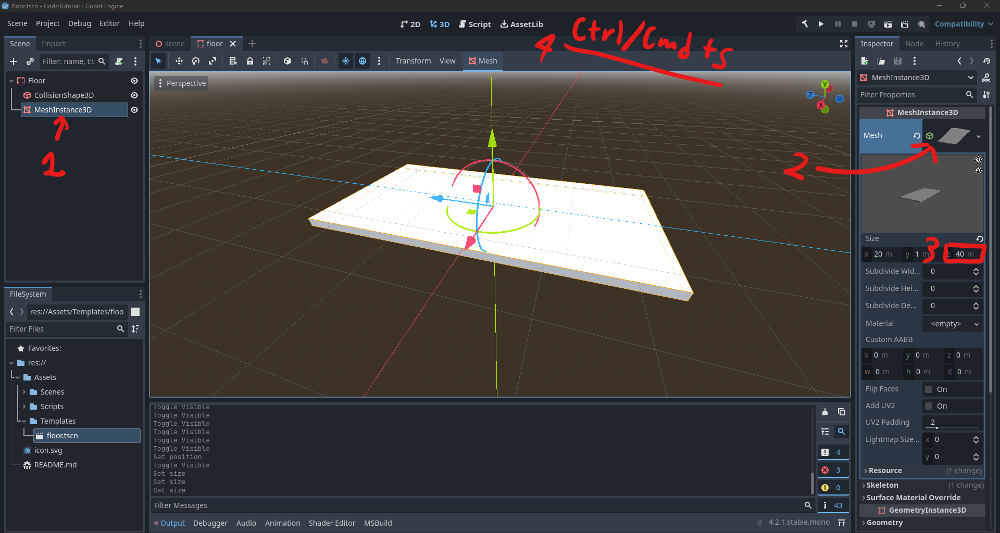


Once you have done that, return to the "scene" tab at the top of your screen to see that in the original scene the floor have expanded. **Note that we only expanded the MeshInstance3D and not the CollisionShape3D. Go ahead and expand that following the same steps as you did for MeshInstance3D.<br><br>
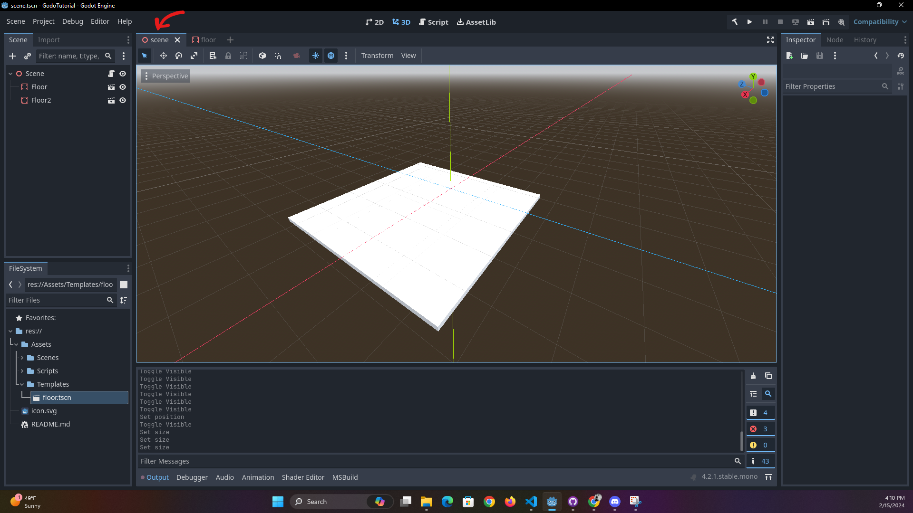