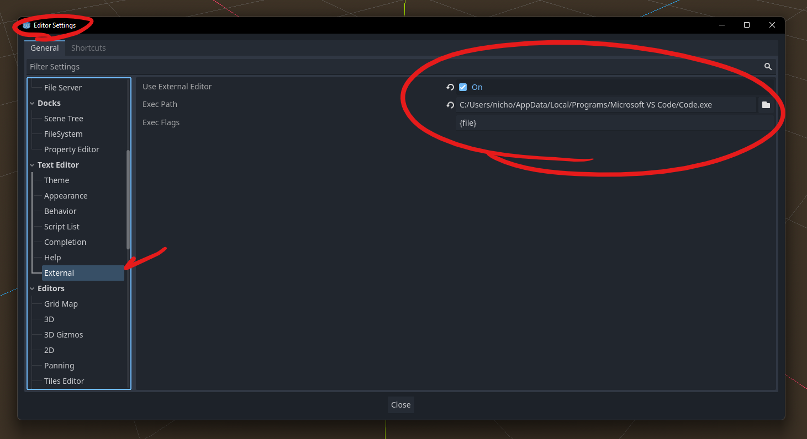

# GodoTutorial
This is a tutorial repo for some friends on some Godot basics. Not much to see here.


# Getting Set Up
There's a few tools you'll need to have downloaded and ready before we get started.
## Downloading the Engine/Dependencies
First thing's first, you need to download the game engine. <br>Go to [this page](https://godotengine.org/download/windows/) and **download the .NET version of Godot**, circled in red below.<br><br>


The game engine comes in a zip folder, so extract it to somewhere more permanent (or don't, I'm not your mom).

---

Next you will want to go to the [.NET download page](https://dotnet.microsoft.com/en-us/download) and get .NET 8.0 by clicking the .NET SDK x64 button, then following the installation instructions. (I didn't end up needing the command line stuff)<br><br>


## GitHub
GitHub Desktop is a great way to manage versions of projects. This will allow us to work independently and keep projects consistent between one another. [Download GitHub Desktop](https://desktop.github.com/) and follow the installation instructions.<br><br>

You can also use command-line git if that makes you happier.

## (Optional) Visual Studio Code
Godot has a built-in editor that works fine, but if you're like me and you want to use something a little more portable, then there is VSCode support. You can download VSCode and follow the installation instructions.<br><br>


Here is a [good video](https://youtu.be/egtBFbWz7N4?si=qkvJw5ZxDrjRuPw9) on how to get VSCode set up, as well as general installation instructions. I noticed the only discrepancy here was in the editor settings, where I had to paste in the path to my VSCode.


# Getting Started
So you think you set everything up right? Well, we'll see about that.<br>
Since everyone has a different skillset, I'll be going in-depth on how to do everything. If something seems familiar, feel free to skip ahead. I'll try to **put any surprising information in bold** so that you can look for it if the rest of the information is just review for you.

## Downloading the Repo
If you didn't know, the project is stored in a git repository, which is essentially where everything you need to build the project will be stored.

1. Open GitHub Desktop and sign in with your GitHub information (if you don't have an account, [go to the website](https://github.com) and sign up).
2. Hit File -> Clone Repository, and select the URL tab.
3. Copy the address of [this GitHub repo](https://github.com/Shropp/GodoTutorial) and paste it into the URL tab. You can find it by hitting the ```<> Code``` button, going to the local tab, and selecting HTTPS.<br><br>
<br><br>
4. Hit Clone, and the project should download.<br><br>


## Importing the Project
This is a very straightforward part of the process - you just need the path where the repo is.
1. Launch Godot by running the executable in your extracted folder.
2. When you launch, hit the import button and navigate to the directory containing the project. Once you've selected it, hit ```Import and Edit``` to open the project.<br><br>


## Testing the installation
Once it's started, you should be able to hit the play button at the top right to build and run the project. If this is done properly, you should have a gray window appear in the center of your screen and a message in the console telling you everything worked as intended.<br><br>
